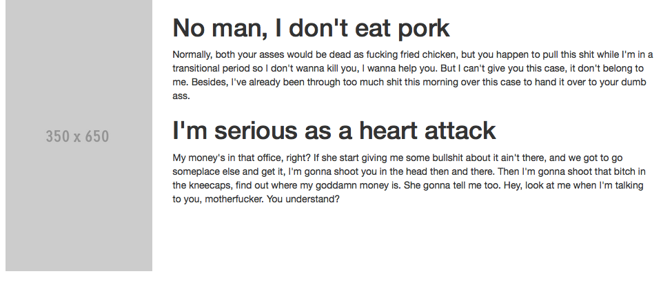

Day 17 - Get you some Git
===============


Quiz 1: Fix this HTML Syntax
-----

Fork this [codepen.io pen](http://codepen.io/jwo/pen/PwKoGG), and fix the syntax. Once you fix, it will make it look
like the following image:




Today:
-----

1. Quiz
1. Git History
1. GitHub Repo creation
1. Git global config
    - email
    - name
    - gitignore
1. Middleman deploy and GitHub Pages


Getting Middleman to deploy to GitHub Pages
----------

1. Add gem to Gemfile `gem 'middleman-deploy', '~> 1.0'`
1. Run Bundle `bundle`
1. Add to config at bottom:  
```ruby
activate :deploy do |deploy|
  deploy.method = :git
  # Optional Settings
  # deploy.remote   = 'custom-remote' # remote name or git url, default: origin
  # deploy.branch   = 'custom-branch' # default: gh-pages
  # deploy.strategy = :submodule      # commit strategy: can be :force_push or :submodule, default: :force_push
  # deploy.commit_message = 'custom-message'      # commit message (can be empty), default: Automated commit at `timestamp` by middleman-deploy `version`
end
```
1. Add inside `config` block:  
```ruby
  activate :relative_assets
  set :relative_links, true
```


Homework
--------

1. Submit a link to your surf and paddle, and running online
1. Have a proper README.md
1. Have it up and running on GitHub pages

Likely, will be http://yourgithub.github.io/surf-and-paddle

